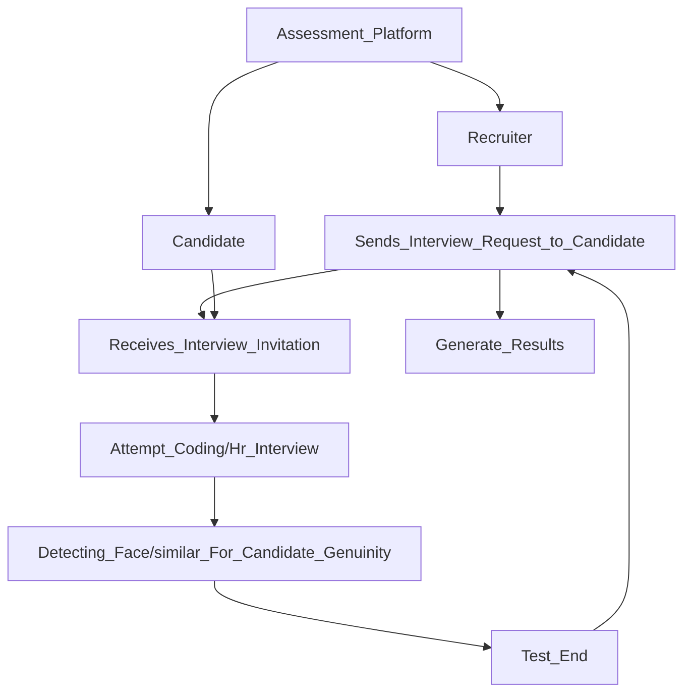
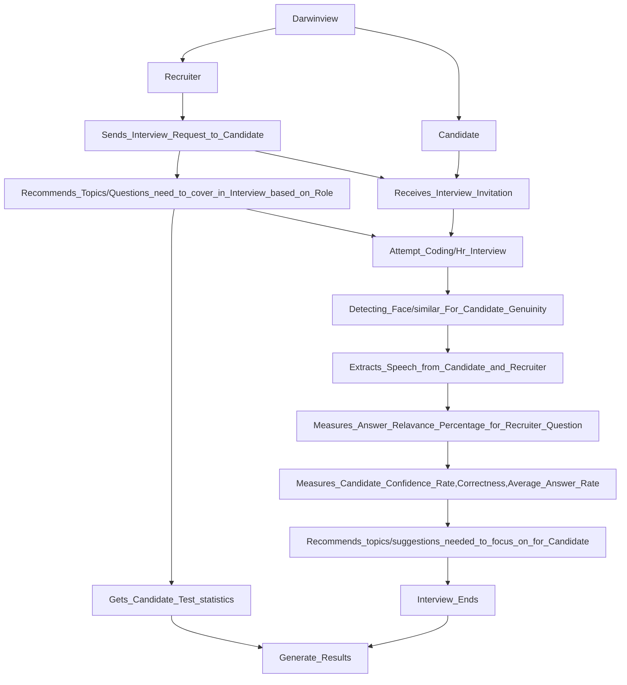

# Darwinview
`Darwinview` is an Intelligent Interview System(IIS) that enables a high-end 1:1 interview experience in the assessments.     
>More formally even if the recruiter makes the wrong hire mistake AI won't.

Foremost let us take a quick look at the ' traditional 1:1 interview system ', in the below diagram.

 Here is a glance at ` Darwinview `  which is enhanced with AI to automate interview experience.

> [!TIP]
> If you want to take a look at the full picture of the online recruitment process, Visit Here https://bit.ly/DarwinBox_Assessments.

Sailent Features of Darwin-View
  
   

- [X] Creates Assessment Platform for 1:1 Interview Session.  
- [X] Extract speech from the candidate  which is answered, Extract speech from the recruiter as well, and outputs the answer relevance rate for the total interview from the candidate data.  
- [X] Includes candidate confidence rate, average answer speed, correctness, test statistics, etc.
- [X] Recommends the improvements/skills to work on from interview to candidate.
- [X] Recommend topics to the recruiter that have to be cover in the interview based on role.

